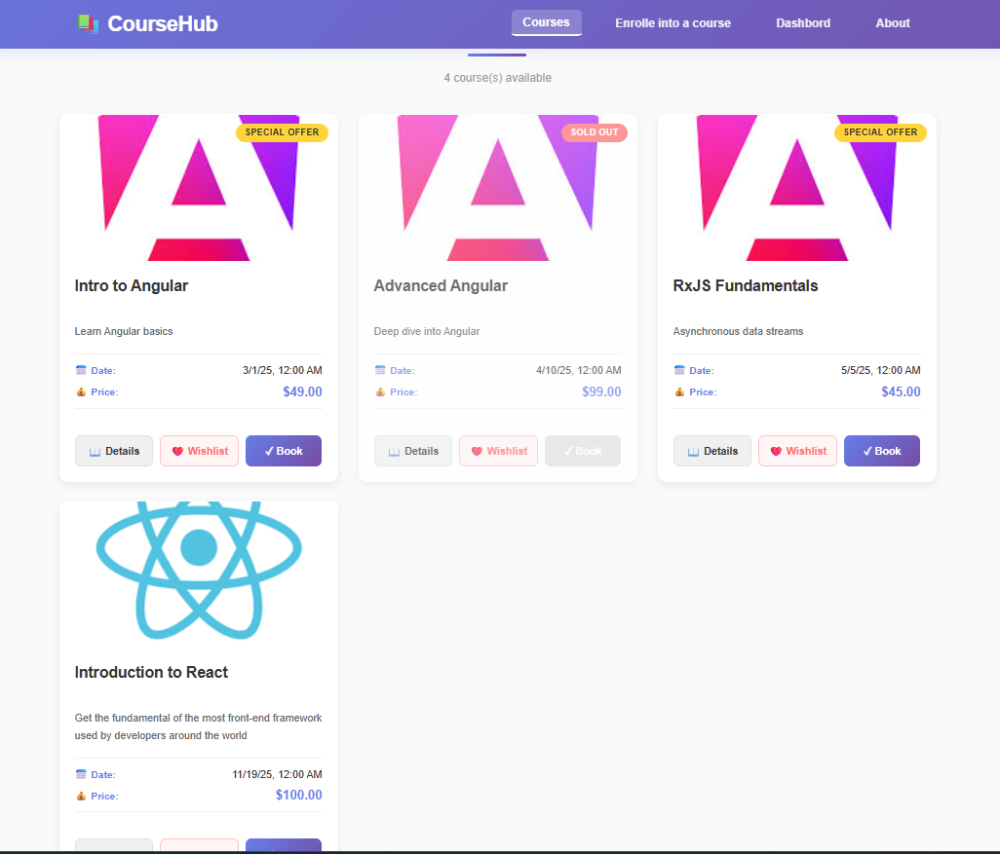
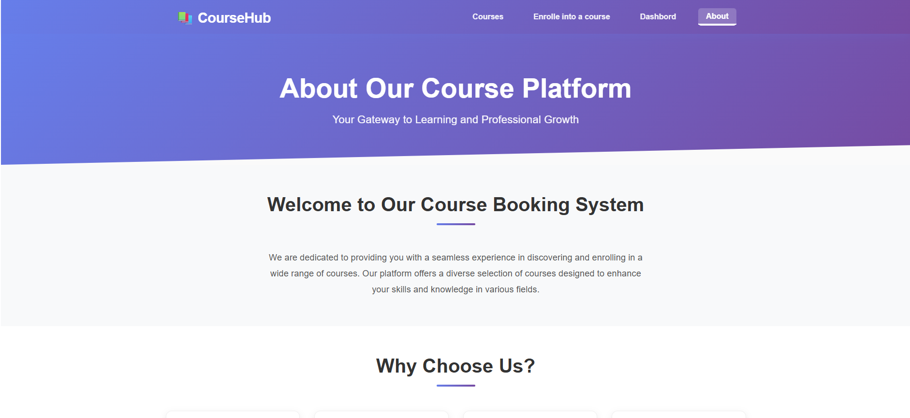
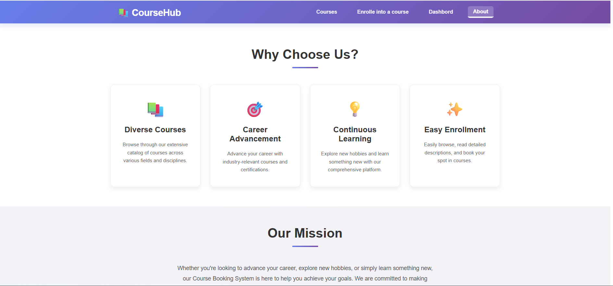
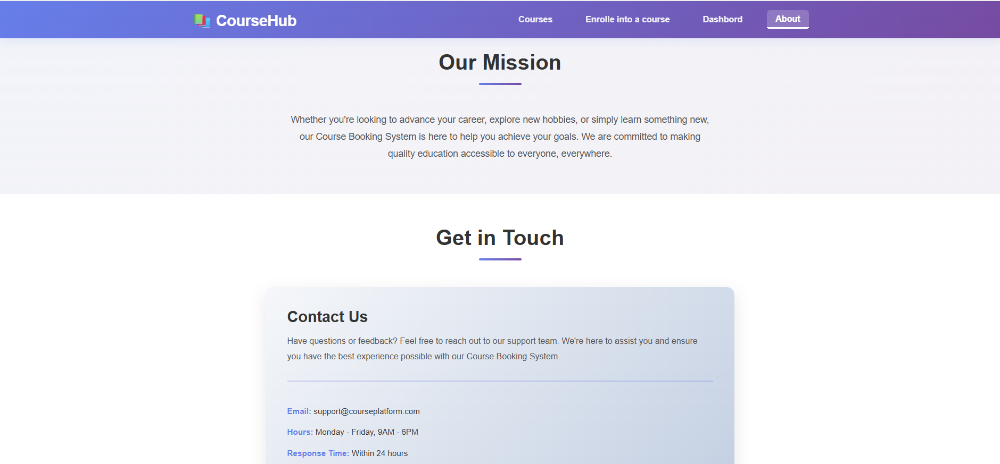
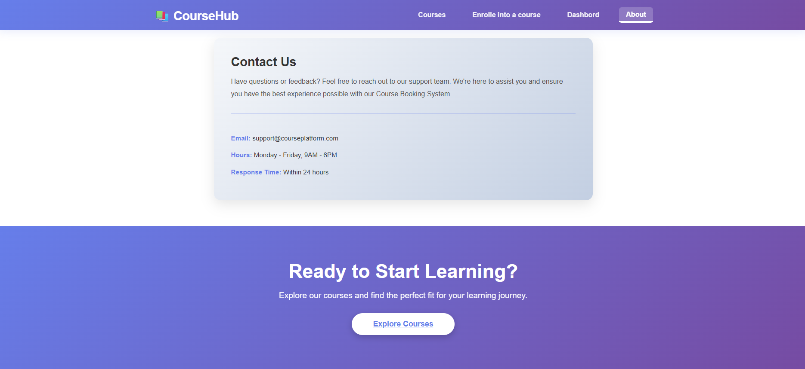
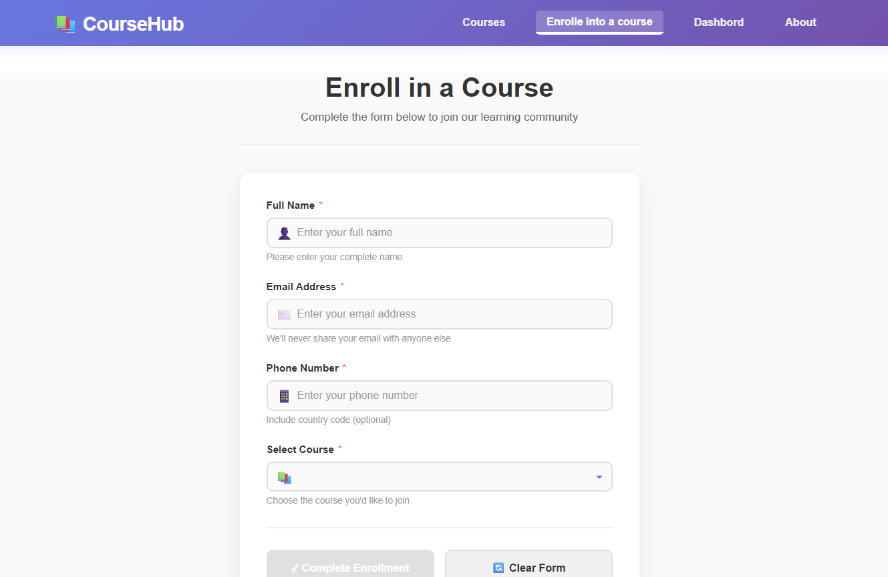
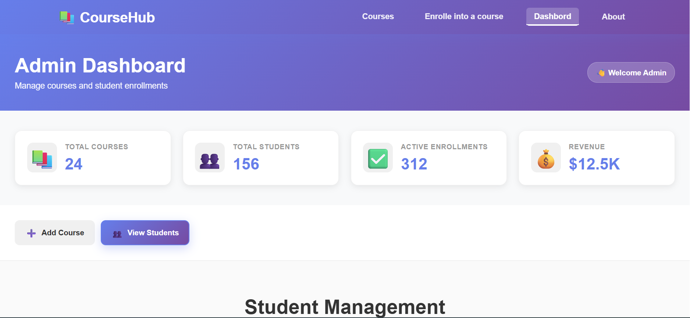
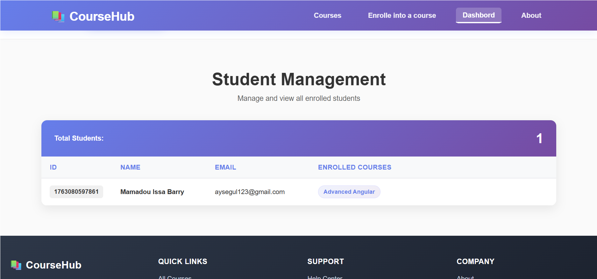

\# 📚 CourseHub - Course Booking System

\# CourseBookingSystem


A modern, responsive Angular application for discovering, booking, and managing online courses. Built with Angular 19, featuring a clean admin dashboard for course and student management.This project was generated using \[Angular CLI](https://github.com/angular/angular-cli) version 19.0.6.


\## 🎯 Features

\## Development server


\### For Students To start a local development server, run:


\- 🔍 \*\*Browse Courses\*\*: Explore a comprehensive catalog of courses with detailed information


\- 🎓 \*\*Course Details\*\*: View in-depth course information, pricing, and enrollment status


\- ❤️ \*\*Wishlist\*\*: Save favorite courses for later enrollmentng serve


\- 📝 \*\*Easy Enrollment\*\*: Simple form-based course enrollment process```


\- 📱 \*\*Responsive Design\*\*: Optimized for desktop, tablet, and mobile devices


Once the server is running, open your browser and navigate to `http://localhost:4200/`. The application will automatically reload whenever you modify any of the source files.


\### For Administrators


\- ➕ \*\*Add Courses\*\*: Create and publish new courses with pricing and availability settings## Code scaffolding


\- 👥 \*\*Student Management\*\*: View all enrolled students and their course enrollments


\- 📊 \*\*Dashboard\*\*: Quick stats overview (total courses, students, enrollments, revenue)Angular CLI includes powerful code scaffolding tools. To generate a new component, run:


\- ⚡ \*\*Easy Navigation\*\*: Intuitive admin interface with organized menu


```bash


\### Generalng generate component component-name


\- 🎨 \*\*Modern UI/UX\*\*: Professional gradient design with smooth animations```


\- 🌐 \*\*About Page\*\*: Comprehensive information about the platform


\- 🦶 \*\*Footer\*\*: Complete footer with links and social mediaFor a complete list of available schematics (such as `components`, `directives`, or `pipes`), run:


\- ♿ \*\*Accessibility\*\*: Semantic HTML and ARIA labels for better accessibility


```bash


\## 🛠️ Tech Stackng generate --help


```


\- \*\*Framework\*\*: \[Angular 19](https://angular.io/)


\- \*\*Language\*\*: TypeScript## Building


\- \*\*Styling\*\*: CSS 3 with responsive design


\- \*\*Routing\*\*: Angular Router with lazy-loaded admin moduleTo build the project run:


\- \*\*Forms\*\*: Reactive Forms with validation


\- \*\*Backend\*\*: Node.js with JSON Server (db.json)```bash


ng build


\## 📁 Project Structure```


```This will compile your project and store the build artifacts in the `dist/` directory. By default, the production build optimizes your application for performance and speed.


src/app/


├── app.component.ts|html|css          # Main app wrapper with navbar \& footer## Running unit tests


├── app.routes.ts                      # Route configuration


├── about-courses/                     # About page componentTo execute unit tests with the \[Karma](https://karma-runner.github.io) test runner, use the following command:


├── course-card/                       # Reusable course card component


├── course-detail/                     # Detailed course view```bash


├── courses-list/                      # Courses listing pageng test


├── sign-up-form/                      # Student enrollment form```


├── services/


│   └── course.service.ts              # Course API service## Running end-to-end tests


├── models/


│   ├── course.model.ts                # Course data modelFor end-to-end (e2e) testing, run:


│   └── student.model.ts               # Student data model


└── features/```bash


&nbsp;   └── admin/                         # Admin feature module (lazy-loaded)ng e2e


&nbsp;       ├── add-course/                # Create new course```


&nbsp;       ├── dashboard/                 # Admin dashboard with stats


&nbsp;       └── student-list/              # View all studentsAngular CLI does not come with an end-to-end testing framework by default. You can choose one that suits your needs.


backend/## Additional Resources


├── server.js                          # Node.js backend server


├── db.json                            # Mock databaseFor more information on using the Angular CLI, including detailed command references, visit the \[Angular CLI Overview and Command Reference](https://angular.dev/tools/cli) page.


└── package.json                       # Backend dependencies

```


\## 🚀 Getting Started


\### Prerequisites

\- Node.js (v18 or higher)

\- npm or yarn package manager

\- Angular CLI installed globally: `npm install -g @angular/cli`


\### Installation


1\. \*\*Clone the repository\*\* (if applicable)

```bash

cd course-booking-system

```


2\. \*\*Install frontend dependencies\*\*

```bash

npm install

```


3\. \*\*Install backend dependencies\*\*

```bash

cd backend

npm install

cd ..

```


\### Running the Application


Then open your browser and navigate to `http://localhost:4200/`


Frontend:

```bash

ng serve

```


Backend:

```bash

cd backend

node server.js

```


\## 📖 Key Pages \& Routes


| Route | Component | Description |

|-------|-----------|-------------|

| `/` | CoursesListComponent | Home page - all courses |

| `/courses` | CoursesListComponent | Course listing with wishlist |

| `/courses/:id` | CourseDetailComponent | Detailed course view |

| `/about` | AboutCoursesComponent | About the platform |

| `/signUpToCourse` | SignUpFormComponent | Student enrollment form |

| `/admin` | DashboardComponent | Admin dashboard (lazy-loaded) |

| `/admin/new-course` | AddCourseComponent | Create new course |

| `/admin/students` | StudentListComponent | View all students |


\## 🏗️ Component Overview


\### Public Components

\- \*\*app.component\*\*: Main layout with navbar and footer

\- \*\*courses-list\*\*: Displays all available courses with wishlist

\- \*\*course-card\*\*: Reusable card showing course summary

\- \*\*course-detail\*\*: Full course details with enrollment CTA

\- \*\*sign-up-form\*\*: Form for student enrollment with validation

\- \*\*about-courses\*\*: Platform information and mission


\### Admin Components

\- \*\*dashboard\*\*: Overview with stats cards and navigation

\- \*\*add-course\*\*: Form to create new courses with validation

\- \*\*student-list\*\*: Table showing all enrolled students


\## 🎨 Design System


\### Color Palette

\- \*\*Primary Gradient\*\*: #667eea → #764ba2 (Purple/Indigo)

\- \*\*Text\*\*: #333 (Dark gray for readability)

\- \*\*Accents\*\*: #ff6b6b (Red), #51cf66 (Green), #ffd43b (Yellow)

\- \*\*Background\*\*: #fafafa (Light gray)


\### Typography

\- \*\*Headings\*\*: Bold, 1.3rem–3.5rem depending on level

\- \*\*Body Text\*\*: 0.9rem–1.05rem with 1.6–1.8 line-height

\- \*\*Code\*\*: Monospace, 0.9rem


\### Responsive Breakpoints

\- \*\*Desktop\*\*: 1024px and above

\- \*\*Tablet\*\*: 768px–1023px

\- \*\*Mobile\*\*: Below 768px


\## 🔧 Development Commands


```bash

\# Start development server

npm start


\# Build for production

npm run build


\# Run unit tests

npm test


\# Run linting

npm run lint


\# Generate new component

ng generate component path/component-name


\# Backend development

cd backend \&\& node server.js

```


\## 📝 Form Validation


\### Sign-Up Form

\- \*\*Name\*\*: Required

\- \*\*Email\*\*: Required, valid email format

\- \*\*Phone\*\*: Required

\- \*\*Course\*\*: Required selection


\### Add Course Form

\- \*\*Title\*\*: Required, minimum length

\- \*\*Description\*\*: Required, minimum length

\- \*\*Price\*\*: Required, minimum value (0)

\- \*\*Date\*\*: Required date

\- \*\*Image URL\*\*: Optional or required (URL format)

\- \*\*On Sale\*\*: Optional checkbox

\- \*\*Sold Out\*\*: Optional checkbox


\## 🔐 API Endpoints (Backend)


\- `GET /courses` - Get all courses

\- `POST /courses` - Create a new course

\- `GET /courses/:id` - Get course by ID

\- `GET /students` - Get all students

\- `POST /students` - Create new student enrollment


\## 📱 Responsive Design Features


\- \*\*Mobile-First Approach\*\*: Base styles for mobile, enhanced for larger screens

\- \*\*Flexible Grid Layouts\*\*: CSS Grid with auto-fit for responsive columns

\- \*\*Touch-Friendly Buttons\*\*: Minimum 44px × 44px for mobile accessibility

\- \*\*Hidden Columns\*\*: Admin tables hide email/course columns on mobile

\- \*\*Optimized Typography\*\*: Font sizes adjust for readability on all devices


\## 🚀 Performance Optimization


\- \*\*Lazy Loading\*\*: Admin module loads on demand

\- \*\*OnPush Change Detection\*\*: Optimized component updates

\- \*\*CSS Minification\*\*: Production builds include minified styles

\- \*\*Image Optimization\*\*: Cover images use object-fit for consistency


\## 👨‍💻 Authors


\*\*Created by\*\*: Aboubacar  

\*\*Angular Version\*\*: 19.0.6  

\*\*Created\*\*: November 2025


\## 🎓 Learning Resources


\- \[Angular Official Docs](https://angular.io/)

\- \[Angular Router Guide](https://angular.io/guide/router)

\- \[Reactive Forms](https://angular.io/guide/reactive-forms)

\- \[Component Styling](https://angular.io/guide/component-styles)


---


\## 🖼️ Quick View


Here are some screenshots showing the main pages of \*\*CourseHub\*\*:


---


\### 🎓 Courses




---


\### ℹ️ About Page


\*\*Overview – Mission – Vision\*\*











---


\### 🧾 Enrollment Form




---


\### 🛠️ Admin Dashboard


\#### Overview




\#### Course \& Student Management




\*\*Happy coding! 🎉\*\*


